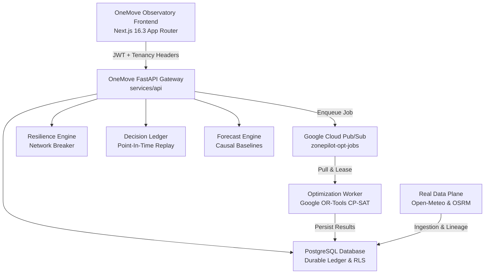

# OneMove — Physical Commerce Network Intelligence & Decision Platform

[](https://github.com/MANEESHREDDYD/OneMove/actions)
[](https://github.com/MANEESHREDDYD/OneMove/actions)
[](https://nextjs.org/)
[](https://python.org/)
[](https://supabase.com/)
[](https://developers.google.com/optimization)

**OneMove** is an enterprise-grade physical commerce network intelligence, resilience evaluation, and decision-optimization platform engineered for urban logistics, facility placement, multi-scenario stress-testing, and Point-In-Time auditable decision tracking.

> **Note on Architecture & Namespace**: The canonical public product name is **OneMove**. The internal engine and Python package namespace is retained as `zonepilot` to preserve stability and avoid unnecessary migration risk.

OneMove is built on an authentic **94-cell Uber H3 (Resolution 8)** spatial partitioning of Bengaluru Urban, with real OpenStreetMap road networks, authentic OSRM travel duration matrices, real-world Open-Meteo weather telemetry, deterministic CP-SAT optimization, and zero mock fallbacks.

---

## System Architecture



---

## Key Capabilities

### 1. Deterministic Multi-Scenario Facility Optimization
- **Mathematical Engine:** Google OR-Tools CP-SAT constraint satisfaction solver.
- **Problem Scale:** 94 demand cells $\times$ 12 candidate facilities $\times$ 3 uncertainty scenarios (Free Flow, Congested, Compound Outage).
- **Exact Lineage:** Deterministic lexicographical tie-breaking guaranteeing identical decisions given identical inputs.
- **Persistence:** All optimization jobs, solver states, wall-clock latencies, and Pareto frontiers are durably persisted in `public.optimization_jobs` and `public.optimization_results`.

### 2. Resilience Engine & Network Breaker
- **Stress-Testing Suite:** Evaluates network degradation under primary corridor cuts (e.g. Silk Board / Outer Ring Road), depot transformer failures, and severe monsoon precipitation (35mm/hr).
- **Quantile Computation:** P50, P90, and P95 tail latency percentiles, disconnected zone counts, and failure exposure scores.
- **Automated Grading:** Deterministic failure classification (`ROBUST`, `MODERATE_DEGRADATION`, `SEVERE_DEGRADATION`, `CRITICAL_FAILURE`).

### 3. Point-In-Time Causality & Decision Time Travel
- **Anti-Leakage Guarantee:** Decision replay strictly enforces $\text{Information Available At} \le \text{Decision Time}$.
- **Immutable Ledger:** Every operational decision records its exact code SHA, dataset version, and input snapshot hash.
- **Prospective Shadow Validation:** Freezes decisions into future observation windows to bound regret against actual observed conditions.

### 4. Evidence Model & Artifact Taxonomy
- **Formal Taxonomy:** Every piece of data is tagged with its evidence class:
  - `OBSERVED`: Real sensor or provider observations (Open-Meteo).
  - `PUBLIC_GEOGRAPHIC`: OpenStreetMap road networks and Uber H3 hexagons.
  - `PUBLIC_OFFICIAL`: Official government census and spatial registries.
  - `DERIVED`: Deterministic OSRM travel matrices and speed baselines.
  - `SIMULATED`: Synthetic disruption injections.
  - `ASSUMPTION`: Explicit proxy economics and cost models.
- **Cryptographic Lineage:** Every dataset and map layer exposes an immutable SHA-256 manifest hash.

### 5. Schema-Grounded Operational Assistant
- **Schema-Grounded AI:** Grounded strictly in verified evidence records from PostgreSQL.
- **Constraint Explanations:** Explains why facilities were opened and provides direct evidence lineage IDs while refusing ungrounded queries.

---

## Cloud Infrastructure (Google Cloud Platform)

OneMove is fully productionized on Google Cloud Platform with dedicated environments managed by Terraform:

- **Staging Project**: `zonepilot-stg-9a4285`
- **Production Project**: `zonepilot-prod-9a4285`
- **Container Registry**: Artifact Registry Docker repository in `asia-south1`
- **Compute**: Auto-scaling Cloud Run v2 services (`onemove-api` & `onemove-worker`)
- **Async Queue**: Google Cloud Pub/Sub with Dead-Letter Queues and exponential backoff
- **Storage**: Versioned Cloud Storage buckets with uniform bucket-level access
- **Security & CI/CD**: Workload Identity Federation tied to `MANEESHREDDYD/OneMove`

---

## Local Development & Testing

### Prerequisites
- Python 3.11+
- Node.js 20+
- Terraform 1.5+

### Running Tests
```bash
# Run full Python backend test suite (275+ tests)
pytest tests/ -v

# Run Observatory routes contract verification
pytest tests/api/test_all_12_observatory_routes.py -v

# Validate Terraform configurations
terraform -chdir=infra/gcp/environments/staging validate
terraform -chdir=infra/gcp/environments/production validate
```

### Running the API Locally
```bash
uvicorn services.api.main:app --host 0.0.0.0 --port 8000 --reload
```

---

## 17-Agent Engineering Architecture
OneMove is maintained and governed by 17 independent parallel ownership streams. See [OWNERSHIP.md](docs/architecture/OWNERSHIP.md) and [DEPENDENCY_GRAPH.md](docs/architecture/DEPENDENCY_GRAPH.md) for detailed contracts and acceptance gates.
