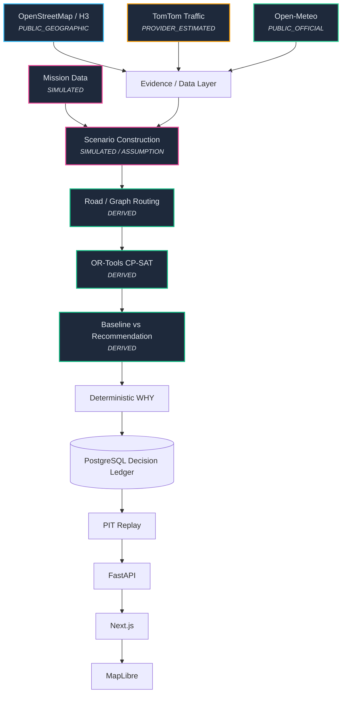

# OneMove Architecture

OneMove is designed to capture changing network conditions and produce explainable, reproducible decisions.

## Evidence Provenance

- **OpenStreetMap / H3**: Base geographic topology and canonical regional divisions (PUBLIC_GEOGRAPHIC)
- **TomTom**: Current traffic speeds and congestion estimates (PROVIDER_ESTIMATED)
- **Open-Meteo**: Weather context (PUBLIC_OFFICIAL)
- **Mission & Scenario**: 16-order delivery data and a controlled facility disruption (SIMULATED)
- **Business inputs**: Declared optimization inputs (ASSUMPTION); capacity is not modeled in this demo
- **Optimization & Recommendation**: The CP-SAT output and expected objective comparisons (DERIVED)

## Core Stack

- **Frontend**: Next.js (React), MapLibre GL JS
- **API**: FastAPI (Python)
- **Solver**: OR-Tools CP-SAT
- **Storage**: PostgreSQL (psycopg 3)
