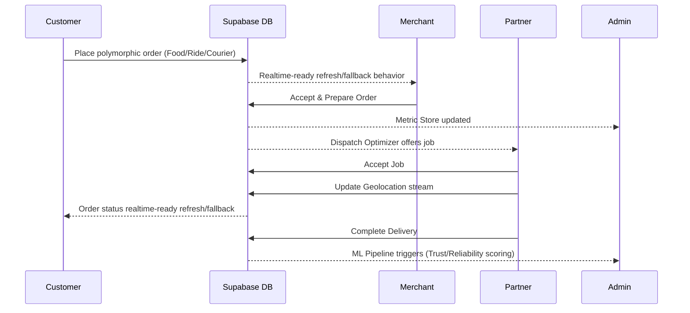
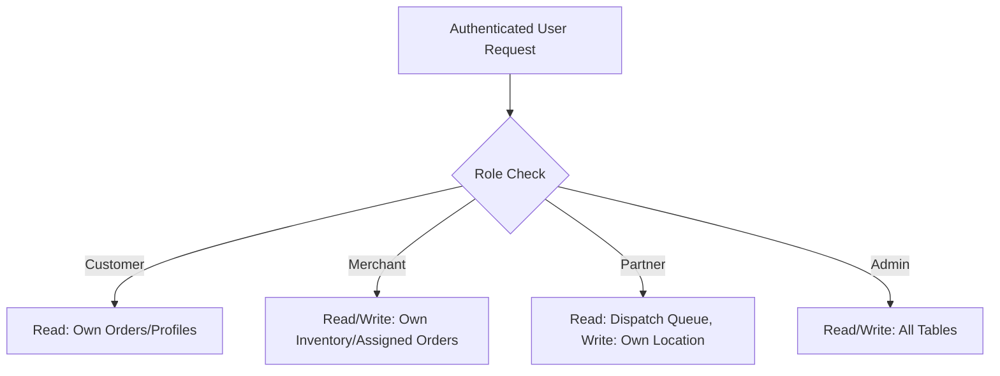
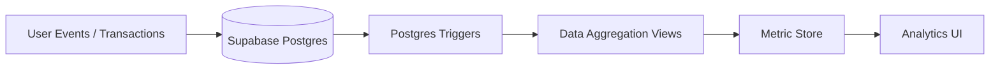
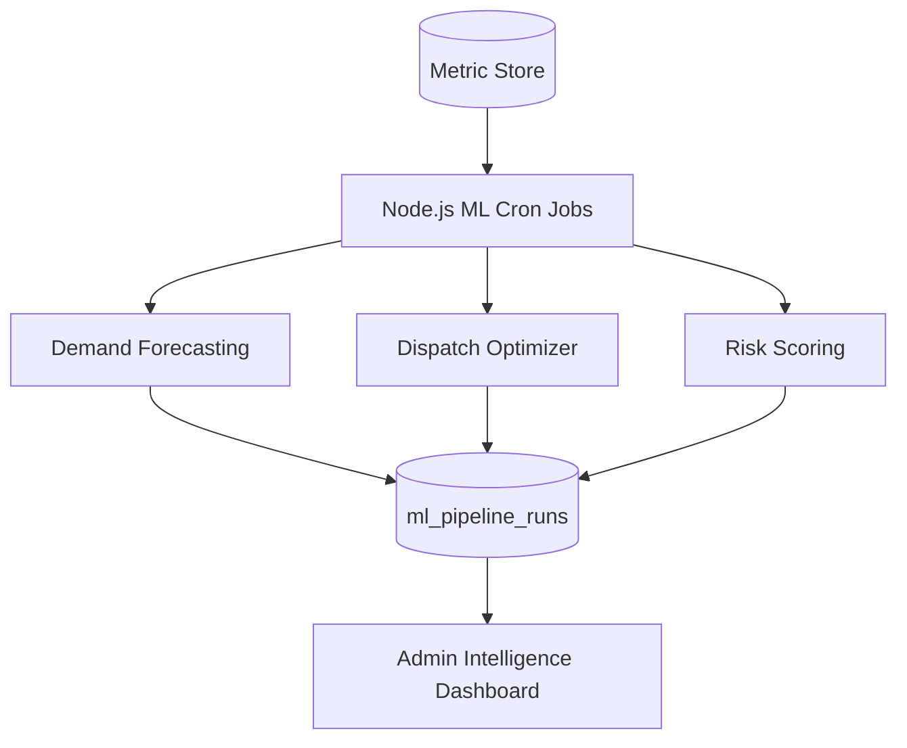

# OneMove: Technical Architecture Overview

**Private localhost portfolio demo: GO**
**Public production deployment: NOT YET APPROVED**

## System Overview
OneMove is built as an edge-first, serverless-ready super-app using Next.js App Router and Supabase. It implements a deep multi-tenant architecture to securely segment data across a four-sided marketplace while operating a sophisticated intelligence layer for data analytics and deterministic ML.

## Four-Sided Marketplace Architecture
The system orchestrates interactions between four distinct user domains:
- **Customers**: B2C interface for ordering and tracking.
- **Merchants**: B2B interface for fulfillment and local analytics.
- **Partners**: Gig-economy interface for real-time dispatch and delivery.
- **Admins**: Internal operations interface for platform governance.

### Customer → Merchant → Partner → Admin Transaction Lifecycle

## Supabase Schema and RLS Model
Data access is enforced at the database level using PostgreSQL Row Level Security (RLS), preventing application-layer leaks.

## Auth and Role Routing Model
Authentication is handled via Supabase Auth with JWT claims. Next.js Middleware and Server Actions explicitly verify the `role` attribute before rendering layouts or executing mutations. Cross-role contamination is prevented by strict URL boundaries (e.g., `/merchant/*` drops non-merchants).

## Polymorphic orders.service_type Model
Instead of fragmented tables for each vertical, OneMove uses a polymorphic `orders` table. The `service_type` enum (`RIDE`, `EATS`, `GROCERY`, `COURIER`) dictates conditional payloads and validation rules, allowing a unified fulfillment engine to process diverse transactions.

## Data Pipeline Architecture

## Deterministic ML/AI Intelligence Architecture
OneMove implements explainable, rule-based intelligence rather than black-box APIs.

## MLOps Logging
Every scheduled ML execution logs its duration, status, and generated row counts to `ml_pipeline_runs`. This ensures observability and audibility for all AI/ML decisions.

## A/B Testing Platform
The platform includes an internal experimentation engine to test feature variants. A simulator script injects synthetic traffic, generates deterministic directional experiment readouts using impressions, conversions, AOV, and revenue-per-user metrics. MVP directional experiment readout; not a production statistical inference engine.

## Testing Strategy
- **Playwright E2E**: Exhaustive end-to-end flows covering happy paths.
- **Playwright Security**: Deep RLS and role-boundary validation testing.
- **Vitest**: Unit testing for isolated business logic.
- **Artillery**: Load and performance testing.

## Known Limitations
- The Experimentation Platform's simulation script can exceed standard Playwright timeout limits (30s) on lower-end mobile workers due to the volume of synthetic data generated.
- The intelligence layer is deterministic (rule-based) and not currently utilizing a trained PyTorch/TensorFlow model, suitable only for MVP demonstration.

## Future Production Roadmap
- Migrate deterministic ML algorithms to a Python-based microservice using FastAPI and trained models.
- Implement Redis for caching high-velocity read queries on the `/showcase` and customer menus.
- Containerize the frontend with Docker for scalable Kubernetes deployment.
