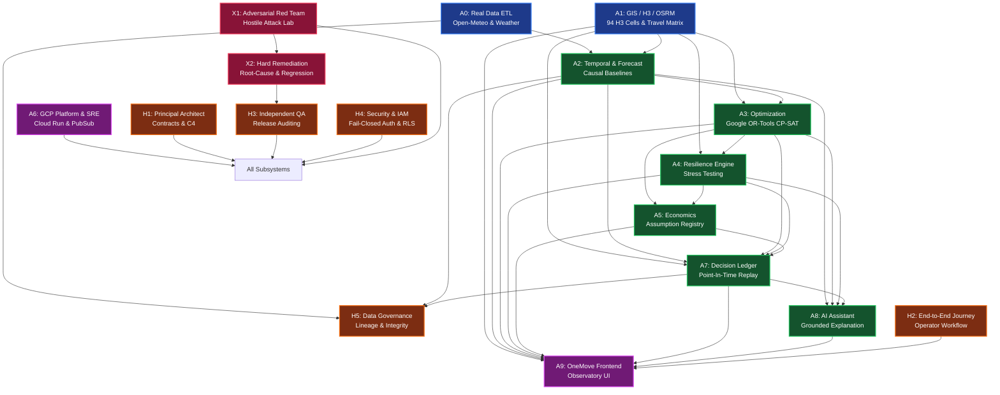

# OneMove — Architecture Dependency Graph

## Stream Interfaces & Contract Boundary

1. **A0 $\to$ Data Lake / PostgreSQL**: Raw immutable weather telemetry and sensor observation payloads.
2. **A1 $\to$ A3 / A4**: Authentic 12x94 OSRM precomputed matrix with SHA-256 integrity verification.
3. **A3 $\to$ Pub/Sub $\to$ A6 Worker**: Asynchronous optimization job requests and durable result persistence.
4. **A7 $\to$ Database**: Strict append-only decision records with full Point-in-Time input snapshots.
5. **H4 $\to$ API Gateway**: Fail-closed bearer token verification requiring workspace and user claims.
6. **X1 $\to$ Failure Ledger $\to$ X2**: Zero-tolerance defect lifecycle requiring unit regression tests and postmortems.
