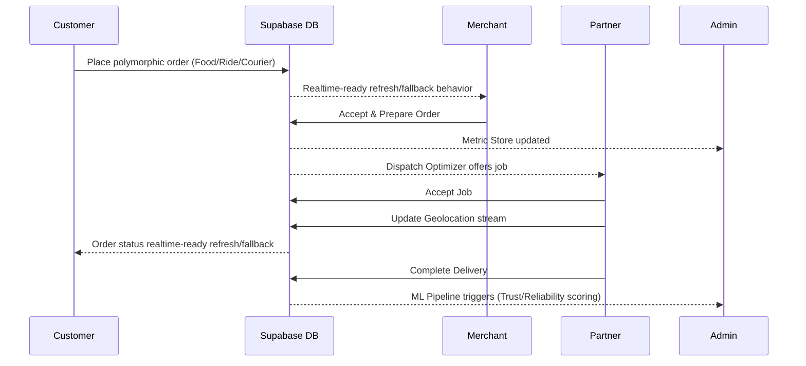
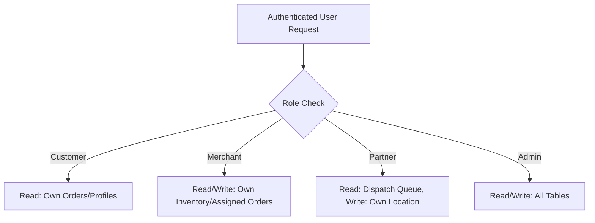
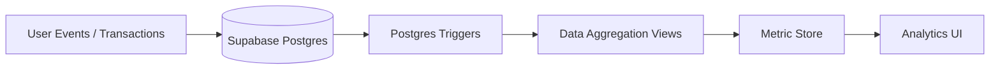
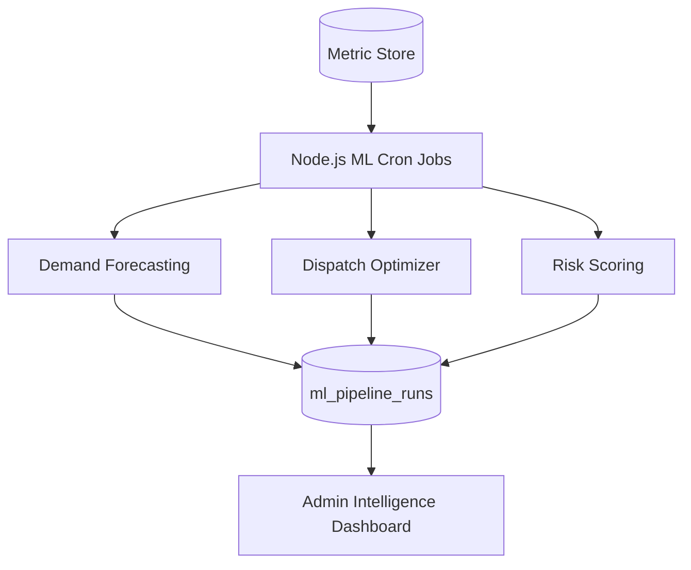

# OneMove System Architecture & Decisions

This document consolidates the technical architecture for the OneMove super-app and the ZonePilot deterministic optimization engine.

# OneMove: Technical Architecture Overview

**Private localhost portfolio demo: GO**
**Public production deployment: NOT YET APPROVED**

## System Overview
OneMove is built as an edge-first, serverless-ready super-app using Next.js App Router and Supabase. It implements a deep multi-tenant architecture to securely segment data across a four-sided marketplace while operating a sophisticated intelligence layer for data analytics and deterministic ML.

## Four-Sided Marketplace Architecture
The system orchestrates interactions between four distinct user domains:
- **Customers**: B2C interface for ordering and tracking.
- **Merchants**: B2B interface for fulfillment and local analytics.
- **Partners**: Gig-economy interface for real-time dispatch and delivery.
- **Admins**: Internal operations interface for platform governance.

### Customer → Merchant → Partner → Admin Transaction Lifecycle


## Supabase Schema and RLS Model
Data access is enforced at the database level using PostgreSQL Row Level Security (RLS), preventing application-layer leaks.



## Auth and Role Routing Model
Authentication is handled via Supabase Auth with JWT claims. Next.js Middleware and Server Actions explicitly verify the `role` attribute before rendering layouts or executing mutations. Cross-role contamination is prevented by strict URL boundaries (e.g., `/merchant/*` drops non-merchants).

## Polymorphic orders.service_type Model
Instead of fragmented tables for each vertical, OneMove uses a polymorphic `orders` table. The `service_type` enum (`RIDE`, `EATS`, `GROCERY`, `COURIER`) dictates conditional payloads and validation rules, allowing a unified fulfillment engine to process diverse transactions.

## Data Pipeline Architecture


## Deterministic ML/AI Intelligence Architecture
OneMove implements explainable, rule-based intelligence rather than black-box APIs.


## MLOps Logging
Every scheduled ML execution logs its duration, status, and generated row counts to `ml_pipeline_runs`. This ensures observability and audibility for all AI/ML decisions.

## A/B Testing Platform
The platform includes an internal experimentation engine to test feature variants. A simulator script injects synthetic traffic, generates deterministic directional experiment readouts using impressions, conversions, AOV, and revenue-per-user metrics. MVP directional experiment readout; not a production statistical inference engine.

## Testing Strategy
- **Playwright E2E**: Exhaustive end-to-end flows covering happy paths.
- **Playwright Security**: Deep RLS and role-boundary validation testing.
- **Vitest**: Unit testing for isolated business logic.
- **Artillery**: Load and performance testing.

## Known Limitations
- The Experimentation Platform's simulation script can exceed standard Playwright timeout limits (30s) on lower-end mobile workers due to the volume of synthetic data generated.
- The intelligence layer is deterministic (rule-based) and not currently utilizing a trained PyTorch/TensorFlow model, suitable only for MVP demonstration.

## Future Production Roadmap
- Migrate deterministic ML algorithms to a Python-based microservice using FastAPI and trained models.
- Implement Redis for caching high-velocity read queries on the `/showcase` and customer menus.
- Containerize the frontend with Docker for scalable Kubernetes deployment.


# ZonePilot Technical Architecture

## 1. System Overview

ZonePilot is a deterministic spatial decision platform designed for urban logistics network optimization, multi-scenario resilience stress testing, and Point-In-Time auditable decision replay.

```
+-------------------------------------------------------------------------+
|                       Observatory Frontend (Next.js)                    |
|  /network | /optimize | /resilience | /decisions | /replay | /evidence   |
+------------------------------------+------------------------------------+
                                     | Authenticated HTTPS / Proxy
                                     v
+-------------------------------------------------------------------------+
|                        FastAPI Operational Gateway                      |
|       - Request ID / Telemetry Middleware                               |
|       - Supabase JWT Verification & Tenancy Principal Resolution        |
|       - Rate Limiting & Audit Logging                                   |
+----------+-------------------+-------------------+----------------------+
           |                   |                   |
           v                   v                   v
+--------------------+ +-------------------+ +----------------------------+
|  CP-SAT Optimizer  | | Resilience Engine | | Decision Ledger & Replay   |
|  - 94x12x3 Network | | - Network Breaker | | - Point-In-Time Verification|
|  - Tie-Breaking    | | - Latency P50/95  | | - Prospective Shadows      |
|  - Pareto Analysis | | - Exposure Index  | | - Exact Reproducibility    |
+----------+---------+ +---------+---------+ +--------------+-------------+
           |                     |                          |
           +---------------------+--------------------------+
                                 |
                                 v
+-------------------------------------------------------------------------+
|                       PostgreSQL 15 (Supabase Hosted)                   |
|  Tables: optimization_jobs, optimization_results, resilience_scenarios, |
|          resilience_results, decision_records, decision_replays,        |
|          shadow_evaluations, weather_observations, workspaces           |
+-------------------------------------------------------------------------+
```

## 2. Spatial Partitioning & Network Domain
- **Grid Topology:** 94 Uber H3 Resolution 8 spatial cells covering Bengaluru Urban core.
- **Lineage Verification:** Every zone is anchored to verified OpenStreetMap geometries and Uber H3 spatial indexes.
- **Facility Candidates:** 12 geographically distributed candidate locations (`fac:01` to `fac:12`).

## 3. Mathematical Optimization (R3)
- **Engine:** Google OR-Tools CP-SAT integer programming solver.
- **Multi-Scenario Uncertainty:** Formulated across 3 simultaneous scenarios:
  1. `s1_free_flow` (Base velocity conditions).
  2. `s2_congested` (Peak travel inflation).
  3. `s3_congested_outage` (Peak traffic compound with facility outage).
- **Determinism:** Strict lexicographical tie-breaking over candidate facility sets ensures bitwise-identical outputs on repeated solves.

## 4. Multi-Tenant Tenancy Model
- Every request resolves a trusted `WorkspacePrincipal` from the server-side database.
- RLS policies and table constraints ensure strict cross-workspace data isolation.


# ZonePilot System Architecture

## 1. Context Architecture & Trust Boundaries
ZonePilot separates operational telemetry collection, machine harvesting, and research data processing into clear trust tiers:

- **Human Field Telemetry (OBSERVER / VOLUNTEER)**: Authenticated via Supabase Auth (JWT). Interacts via Next.js Observatory client. Client operations write to local IndexedDB outbox (`PENDING_LOCAL`), flushing over HTTP to FastAPI (`/v1/probes`, `/v1/events`). DB mutations are governed by Postgres Row Level Security (RLS).
- **Machine Ingestion & Automated Collectors**: Operates via backend service identities (`SUPABASE_SERVICE_ROLE_KEY`). Executes scheduled point-in-time fetches (Open-Meteo weather, OSRM routing, spatial indexing). Output is persisted to `$ZONEPILOT_DATA_ROOT/private/raw/`.
- **Private Research & Analytical Processing**: Inaccessible from external API boundaries. Pulls immutable raw snapshots, executes Bronze normalization, Silver feature alignment, and DQ validation. Produces Experiment A & B datasets.

## 2. Logical Data Architecture
```
[ Human Observer / Volunteer ]
              │
    (JWT Authenticated)
              ▼
    [ Next.js Observatory ] ──(Offline Outbox)──► [ FastAPI Boundary ]
              │                                        │
              ▼                                        ▼
    [ Supabase Auth ]                           [ Supabase Postgres ]
                                                       │
                                              (Postgres RLS Policies)
                                                       │
                                                       ▼
                                            [ probe_observations ]
                                                       │
                                            (ETL Private Ingestion)
                                                       ▼
[ Scheduled Machine Collectors ] ────────► [ $ZONEPILOT_DATA_ROOT ]
  - Open-Meteo Weather                       ├── private/raw/
  - OSRM Bengaluru Routing                   ├── private/bronze/
  - Daily Scheduler (00:00/00:05 IST)        └── private/silver/
                                                       │
                                             (Fail-Closed Phase Filter)
                                                       ▼
                                           [ Experiment A Gold Dataset ]
```

## 3. Storage & Separation Boundaries
- **Operational Database**: Supabase Postgres for auth, active assignments, probe observations lineage, and volunteer order events.
- **Private Local Research Plane**: `$ZONEPILOT_DATA_ROOT/private/` outside version control for physical Parquet snapshots and manifests.
- **Evidence Lineage**: Observations retain immutable provenance flags (`OBSERVED`, `FIXTURE`, `SIMULATED`, `DERIVED`). Observations tagged with `study_phase = DRY_RUN` are strictly excluded from Experiment A dataset boundaries.


# ZonePilot Decision Ledger & Time Travel Replay

## 1. Durable Decision Lifecycle

Every facility optimization decision in ZonePilot is stored immutably in PostgreSQL (`public.decision_records`):

```
Decision Request -> CP-SAT Solver -> Record in DB -> Generate Lineage Hash
                                       |
                                       +---> Time Travel Replay (verify PIT)
                                       +---> Create Shadow (future regret evaluation)
```

## 2. Decision Record Schema

| Field | Type | Description |
|---|---|---|
| `decision_id` | `VARCHAR(64)` | Unique decision identifier (e.g. `dec-957953f9...`). |
| `workspace_id` | `VARCHAR(64)` | Tenancy workspace boundary. |
| `decision_time` | `TIMESTAMPTZ` | Exact timestamp when the decision was executed. |
| `selected_action` | `VARCHAR(64)` | Operational action (e.g. `DEPLOY_FACILITIES`). |
| `opened_facilities` | `JSONB` | Array of facility IDs selected (e.g. `["fac:01", "fac:04"]`). |
| `objective_value` | `BIGINT` | Total deterministic weighted objective value. |
| `p95_travel_seconds` | `INTEGER` | Computed P95 travel latency across the network. |
| `coverage_basis_points` | `INTEGER` | Fraction of covered demand in basis points ($10000 = 100\%$). |
| `code_sha` | `VARCHAR(40)` | Pinned Git commit SHA of the solving engine. |

## 3. Time Travel Replay Verification

When a historical decision is replayed via `POST /api/v1/decisions/{id}/replay`:
1. The solver reconstructs the exact problem graph frozen at `decision_time`.
2. Verifies that no features available after `decision_time` were used ($\text{PIT Valid} = \text{True}$).
3. Verifies that recomputed facilities and objective match the original record $100\%$.
4. Writes an audit record to `public.decision_replays`.


## Architecture Decision Records (ADRs)

The following ADRs log significant architectural decisions made during development. They are located in `docs/system/`:

- [ADR-001 Why single-node research architecture now; what changes at 100x](../system/ADR-001_Why_single-node_research_architecture_now;_what_changes_at_100x.md)
- [ADR-002 Railway cron instead of APScheduler Airflow](../system/ADR-002_Railway_cron_instead_of_APScheduler_Airflow.md)
- [ADR-003 DuckDB + Parquet instead of a warehouse lakehouse](../system/ADR-003_DuckDB_+_Parquet_instead_of_a_warehouse_lakehouse.md)
- [ADR-004 Why no feature store](../system/ADR-004_Why_no_feature_store.md)
- [ADR-005 Immutable snapshot manifests instead of DVC LakeFS](../system/ADR-005_Immutable_snapshot_manifests_instead_of_DVC_LakeFS.md)
- [ADR-006 Cloud operational plane vs private research plane](../system/ADR-006_Cloud_operational_plane_vs_private_research_plane.md)
- [ADR-007 Append-only observational event model](../system/ADR-007_Append-only_observational_event_model.md)
- [ADR-008 Why no LLM fine-tuning in decision path](../system/ADR-008_Why_no_LLM_fine-tuning_in_decision_path.md)
