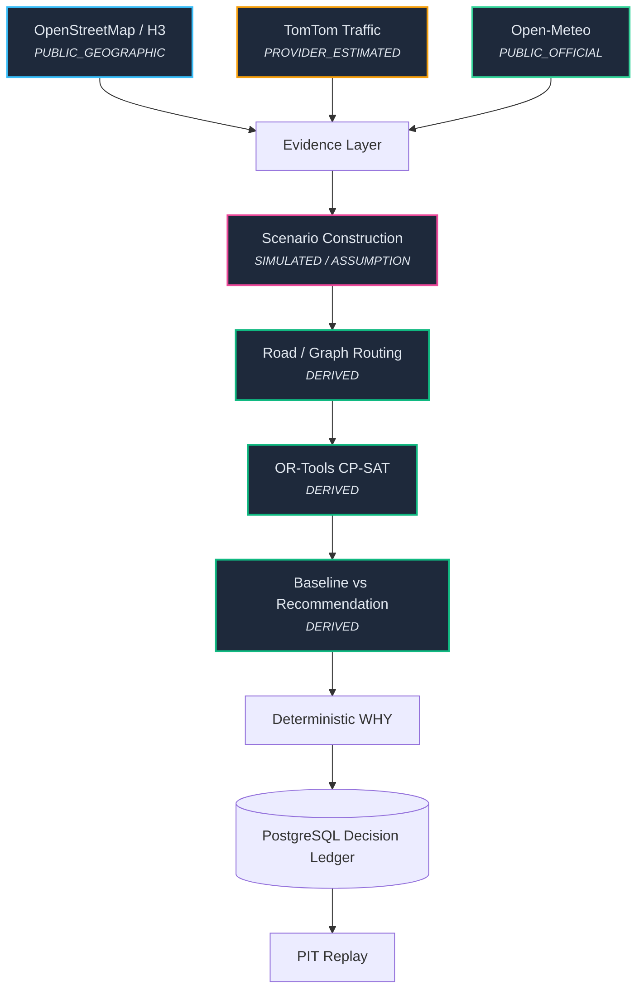

# OneMove

**Physical-commerce network decision intelligence.**

Author: Maneesh Reddy Duddukunta

## Problem

Operators make network decisions across fragmented geographic, traffic, weather, demand and operational systems.

## What OneMove Does
- **OPERATE**: See what is happening.
- **SIMULATE**: Model what could happen.
- **DECIDE**: Compare doing nothing with recommended action.
- **PROVE**: Record why the decision was made and replay it later.

## Demo Proof
- Real Bengaluru road geography
- Current provider context
- 16 simulated delivery orders
- Simulated disruption
- CP-SAT optimization
- Do Nothing baseline
- Recommended action
- Deterministic WHY
- Frozen evidence
- PIT replay

## What Is Real?
- **Geography** — PUBLIC_GEOGRAPHIC
- **Traffic** — PROVIDER_ESTIMATED
- **Weather** — PUBLIC_OFFICIAL
- **Orders** — SIMULATED
- **Scenario** — SIMULATED
- **Recommendation** — DERIVED
- **Business economics** — NOT MODELED

## Architecture

## Current Limitations
- Single Bengaluru pilot
- 16-order outreach mission
- Routing is road-network based but not traffic-aware
- Current provider freshness depends on external availability
- No real retailer/customer data
- Business economics are not modeled
- Continuous production scheduling not yet certified
- Human approval/override workflow not yet final production workflow
- Multi-city scale not yet demonstrated

## Contact
Maneesh Reddy Duddukunta
[GitHub](https://github.com/MANEESHREDDYD)
