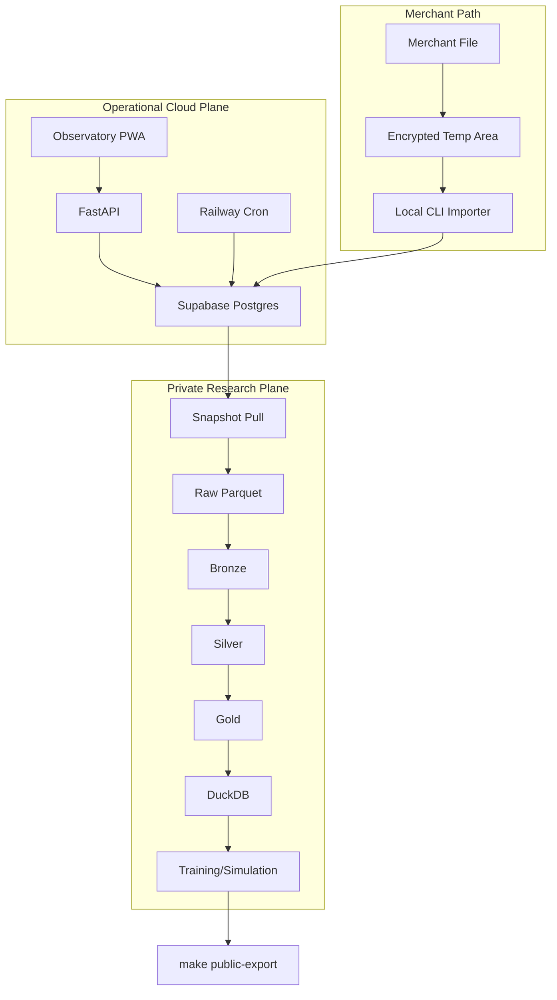

# Data Flow

```mermaid
graph TD
    subgraph Operational Cloud Plane
        PWA[Observatory PWA] --> API[FastAPI]
        API --> DB[Supabase Postgres]
        Cron[Railway Cron] --> DB
    end
    subgraph Merchant Path
        Merchant[Merchant File] --> Temp[Encrypted Temp Area]
        Temp --> Importer[Local CLI Importer]
        Importer --> DB
    end
    subgraph Private Research Plane
        DB --> Pull[Snapshot Pull]
        Pull --> Raw[Raw Parquet]
        Raw --> Bronze --> Silver --> Gold
        Gold --> DuckDB
        DuckDB --> Models[Training/Simulation]
    end
    Models --> Export[make public-export]
```
