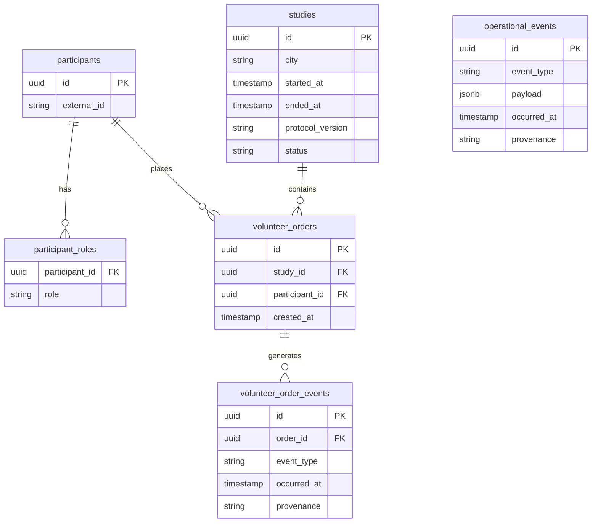

# Schema Diagram

```mermaid
erDiagram
    studies {
        uuid id PK
        string city
        timestamp started_at
        timestamp ended_at
        string protocol_version
        string status
    }
    participants {
        uuid id PK
        string external_id
    }
    participant_roles {
        uuid participant_id FK
        string role
    }
    volunteer_orders {
        uuid id PK
        uuid study_id FK
        uuid participant_id FK
        timestamp created_at
    }
    volunteer_order_events {
        uuid id PK
        uuid order_id FK
        string event_type
        timestamp occurred_at
        string provenance
    }
    operational_events {
        uuid id PK
        string event_type
        jsonb payload
        timestamp occurred_at
        string provenance
    }
    
    studies ||--o{ volunteer_orders : contains
    participants ||--o{ participant_roles : has
    participants ||--o{ volunteer_orders : places
    volunteer_orders ||--o{ volunteer_order_events : generates
```
