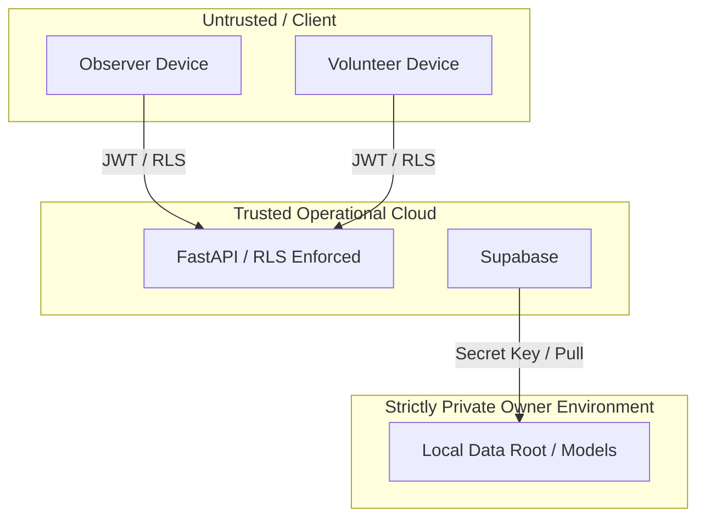

# Trust Boundaries

```mermaid
graph TD
    subgraph Untrusted / Client
        Observer[Observer Device]
        Volunteer[Volunteer Device]
    end
    subgraph Trusted Operational Cloud
        API[FastAPI / RLS Enforced]
        DB[Supabase]
    end
    subgraph Strictly Private Owner Environment
        Research[Local Data Root / Models]
    end
    Observer -->|JWT / RLS| API
    Volunteer -->|JWT / RLS| API
    DB -->|Secret Key / Pull| Research
```
